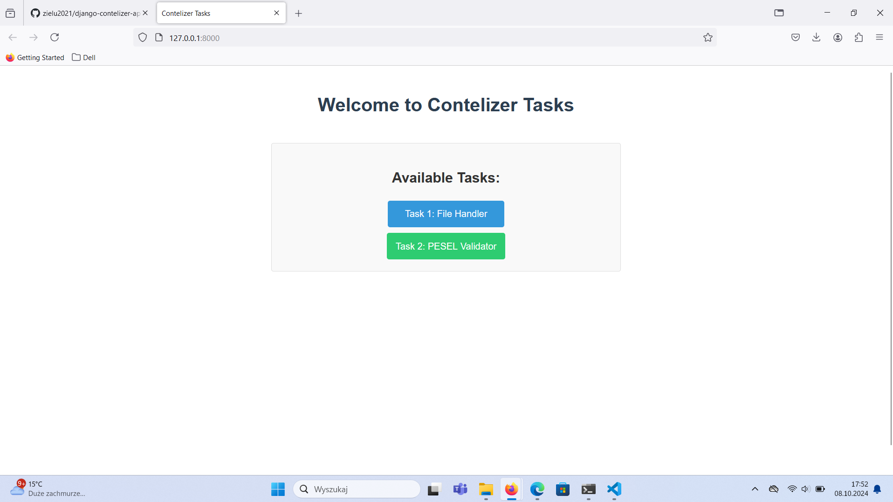
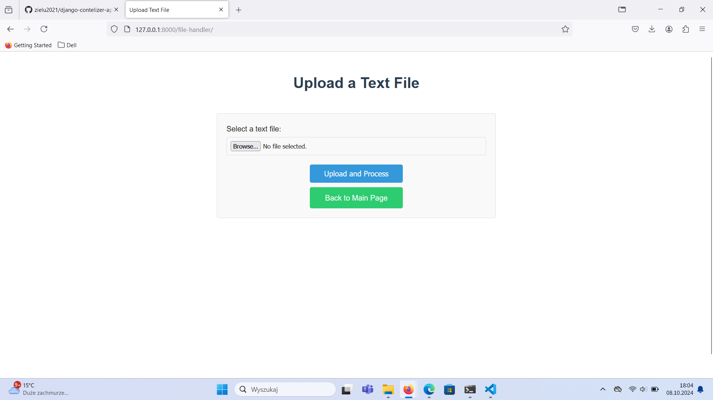
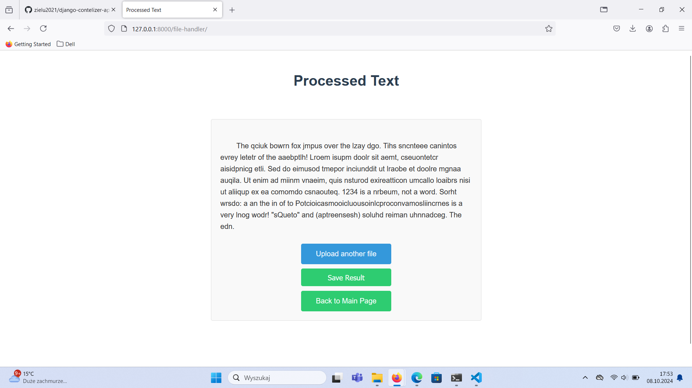
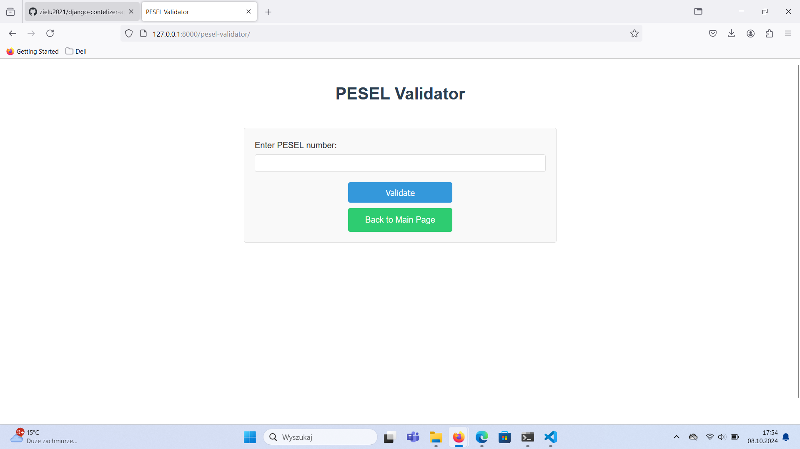
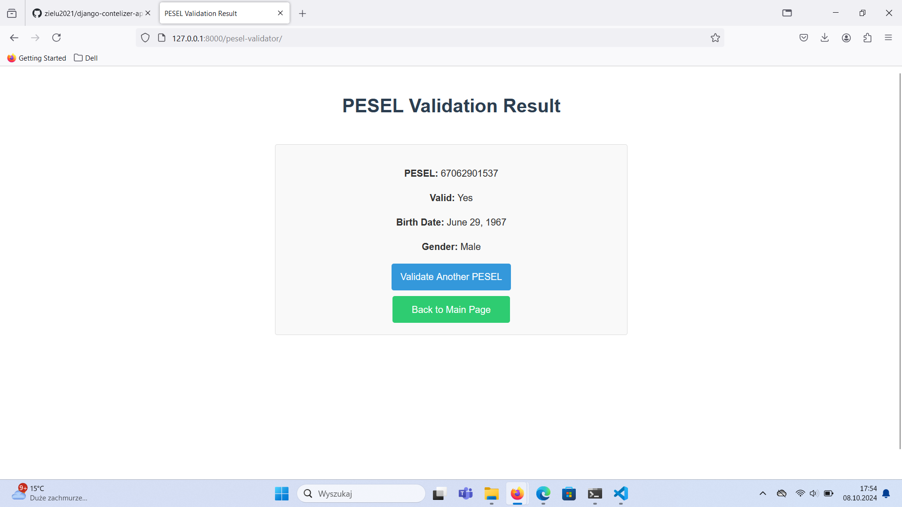
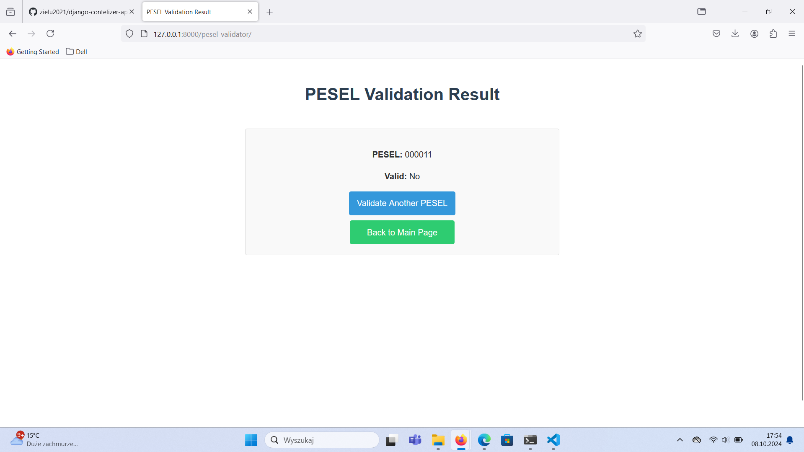

# Contelizer Tasks

Contelizer Tasks is a Django-based web application that consists of two main functionalities: a Text Processing App and a PESEL Validator. This project demonstrates the implementation of basic text manipulation and Polish national identification number (PESEL) validation in a web environment.

## Features

### 1. Text Processing App

This application allows users to upload a text file and processes it by shuffling the letters in the middle of each word while keeping the first and last letters in their original positions.

Key features:
- File upload functionality
- Text processing algorithm
- Display of processed text
- Option to save the processed text

### 2. PESEL Validator

This application provides a form where users can input a PESEL number (Polish national identification number) and validates it according to the official specification.

Key features:
- PESEL number input form
- Validation of PESEL number
- Display of validation results, including:
  - Validity of the PESEL number
  - Extraction of birth date
  - Determination of gender

## Technology Stack

- Python
- Django
- HTML/CSS
- JavaScript (for minor interactions)

## Setup and Installation
### Option 1: Local Environment

1. Clone the repository:
   ```
   git clone https://github.com/zielu2021/django-contelizer-apps.git
   cd django-contelizer-apps
   ```

2. Create a virtual environment and activate it:
   ```
   python -m venv venv
   source venv/bin/activate  # On Windows use `venv\Scripts\activate`
   ```

3. Install the required packages:
   ```
   pip install -r requirements.txt
   ```

4. Apply the database migrations:
   ```
   python manage.py migrate
   ```

5. Run the development server:
   ```
   python manage.py runserver
   ```

6. Open a web browser and navigate to `http://127.0.0.1:8000/` to access the application.

### Option 2: Using Docker
1. Clone the repository:
   ```
   git clone https://github.com/zielu2021/django-contelizer-apps.git
   cd django-contelizer-apps
   ```

2. Build the Docker image:
   ```
   docker build -t contelizer-app .
   ```

3. Run the Docker container:
   ```
   docker run -p 8000:8000 contelizer-app
   ```

6. Open a web browser and navigate to `http://127.0.0.1:8000/` to access the application.

## Usage

### Text Processing App
1. Navigate to the Text Processing App from the main page.

2. Upload a text file using the provided form.
3. The app will process the text, shuffling the middle letters of each word.

4. View the processed text on the result page.

5. Optionally, save the processed text to a new file.

### PESEL Validator

1. Navigate to the PESEL Validator from the main page.
2. Enter a PESEL number in the input field.

3. Submit the form to validate the PESEL number.
4. View the validation results, including validity, birth date, and gender.




## Contributing

Contributions to improve Contelizer Tasks are welcome. Please feel free to submit a Pull Request.
